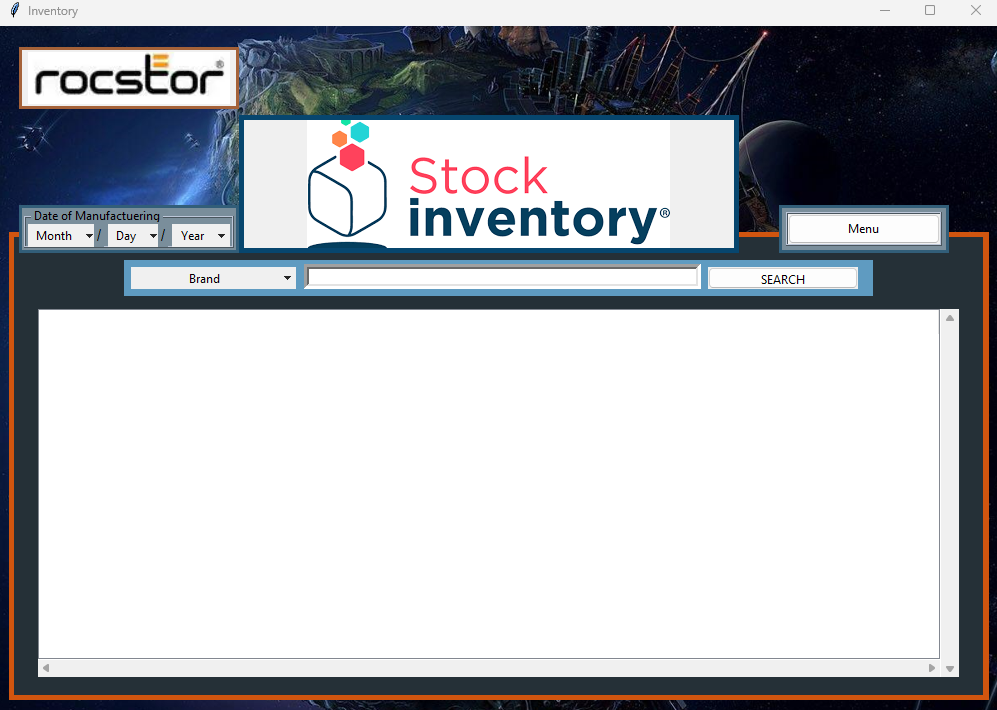
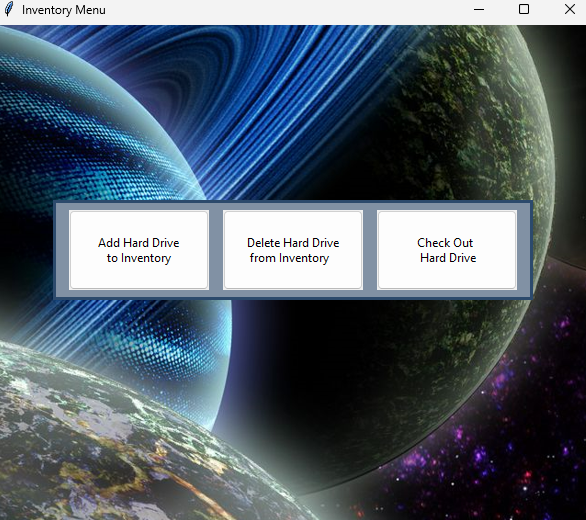
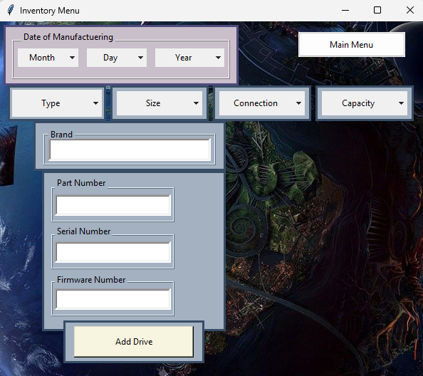
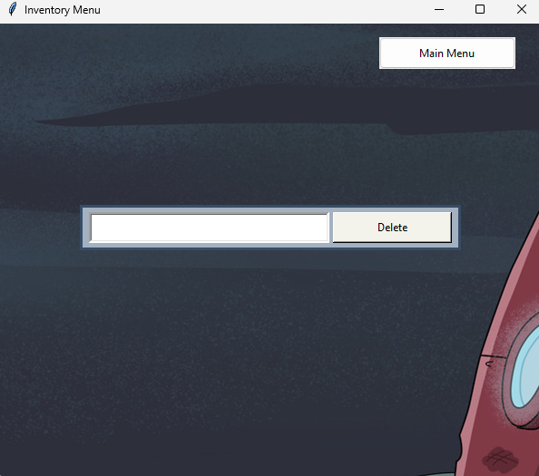
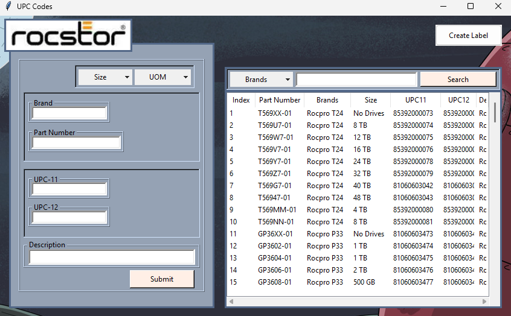

# CRM
This is a customer relations management software for an e-commerce company 

### Issue:
The company I was working for was using an open source ticketing system called, "open ticket". Unfortunately, it lacked to display important information regading some products, such as; firmeware numbers, type, size, connection, capacity, and UPC numbers. Records of customer RMA's were kept in an excel sheet. Also, we would temporarily use some of the hard drives from inventory for testing, but had no record of the hard drives being checked out or checked in.

### Features:
- GUI interface
- Data stored in local database
- Inventory management for hard drives
- RMA entry and display
- UPC entry and display

### Installation:
```bash
git clone https://github.com/adylon/CRM.git
cd CRM
python etickets.py
```

### Usage:
- When you run script you will be brought to the main menu with tabs displayed: Inventory, RMA, and UPC & Labels:


##### Inventory Tab:
- Enter any information in the search query in relevence to the option box
- You can filter for specific dates above the item option box
- Click search



- Click menu to see the following:



##### Add Hard Drive to Inventory:
- Enter hard drive information and click, "Add Drive" to submit to local database
- Click, "Main Menu" to return back to hard drive menu



##### Delete Hard Drive from Inventory:
- Enter hard drive serial number and then click delete from local database



##### Check Out Hard Drive:
- Input serial number followed the option box. Choose to check in or out the hard drives. Enter the serial number then click submit.


##### RMA:
- Enter customer RMA information followed by submit button
- Use search query in the bottom of the page according to option box, then click search


##### UPC & Labels:
- 

