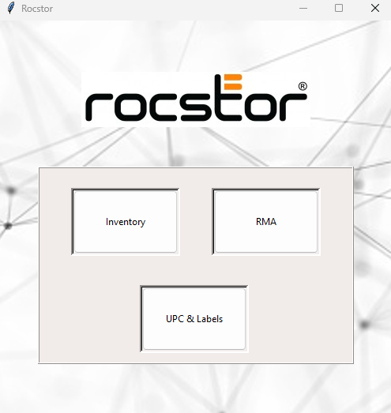

# CRM
This is a customer relations management software for an e-commerce company 

### Issue:
The company I was working for was using an open source ticketing system called, "open ticket". Unfortunately, it lacked to display important information regading some products, such as; firmeware numbers, type, size, connection, capacity, and UPC numbers. Records of customer RMA's were kept in an excel sheet. 

### Features:
- GUI interface
- Data stored in local database
- Inventory management for hard drives
- RMA entry and display
- UPC entry and display

### Installation:
```bash
git clone https://github.com/adylon/CRM.git
cd CRM
python etickets.py
```

### Usage:
- When you run script you will be brought to the main menu with tabs displayed: Inventory, RMA, and UPC & Labels:


##### Inventory Tab:
- Enter any information in the search query in relevence to the option box
- You can filter for specific dates above the item option box
- Click search


