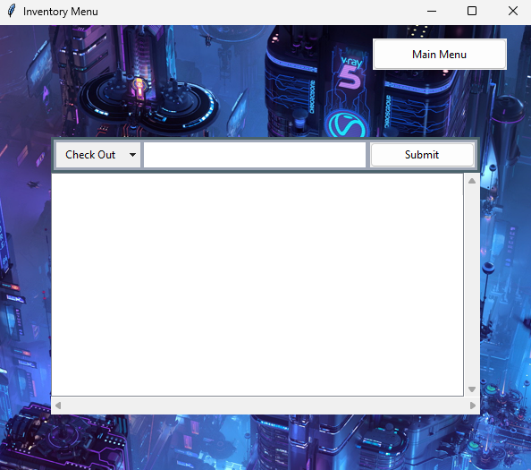
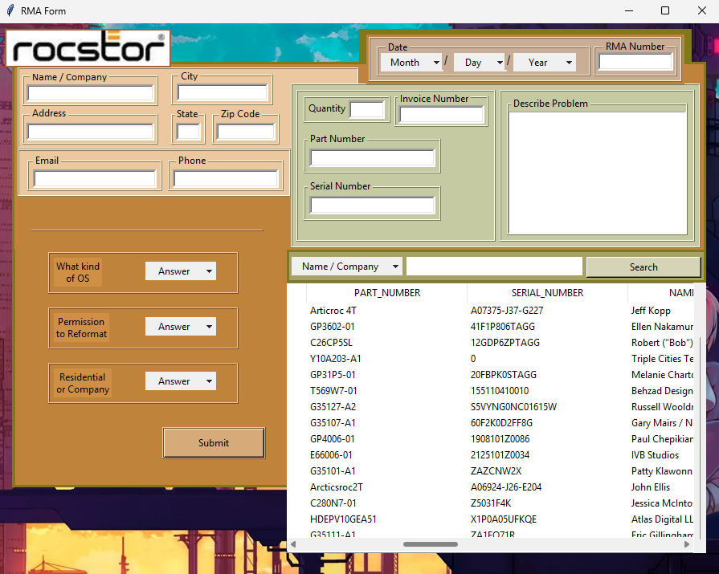
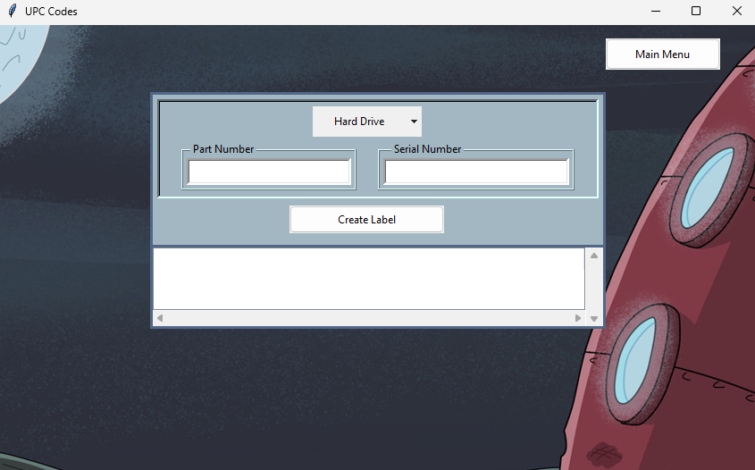

# CRM
This is a customer relations management software for an e-commerce business

### Issue:
I was working with this e-commerce that produced RAID units, cables, server racks, and more. For managing customer info, inverntory, shipping, and work orders we use an open source ticketing system called, "open ticket". Unfortunately, it lacked in performance for specific tasks and to display important information regading some products, such as; firmeware numbers, type, size, connection, capacity, and UPC numbers. Records of customer RMA's were kept in an excel sheet that was not sorted properly making it difficult to refer back to any repair records. At times we would temporarily use the hard drives from inventory for testing, but had no record of the hard drives being checked out or checked in. Creating labels for produtcs was done in a seperate program that needed to be done manually by choosing the template and importing .xslx to fill in data for label.

### Features:
- GUI interface
- Data stored in local database
- Inventory management for hard drives
- RMA entry and display
- UPC entry and display

### Installation:
```bash
git clone https://github.com/adylon/CRM.git
cd CRM
python etickets.py
```

### Usage:
- When you run script you will be brought to the main menu with tabs displayed: Inventory, RMA, and UPC & Labels:


##### Inventory Tab:
- Enter any information in the search query in relevence to the option box.
- You can filter for specific dates above the item option box.
- Click search.


- Click menu to see the following:


##### Add Hard Drive to Inventory:
- Enter hard drive information and click, "Add Drive" to submit to local database.
- Click, "Main Menu" to return back to hard drive menu.


##### Delete Hard Drive from Inventory:
- Enter hard drive serial number and then click delete from local database.


##### Check Out Hard Drive:
- Input serial number followed the option box. Choose to check in or out the hard drives. Enter the serial number then click submit.



##### RMA:
- Enter customer RMA information followed by submit button
- Use search query in the bottom of the page according to option box, then click search.



##### UPC & Labels:
- On the left side of the page, insert information regarding RAID unit built for shipment. Click submit when finished. 
- To see RAID unit inventory use the search query on the right side. Add information in the entry box that corresponds with the option box on the left side.


##### Create Label:
- This page is for creating labels for shipment. Choose the brand of hard drives stored in RAID unit using the option box on the top middle of the page. Enter the part and serial number in the entry boxes and click enter when complete. Followed by a display of the label contents.




